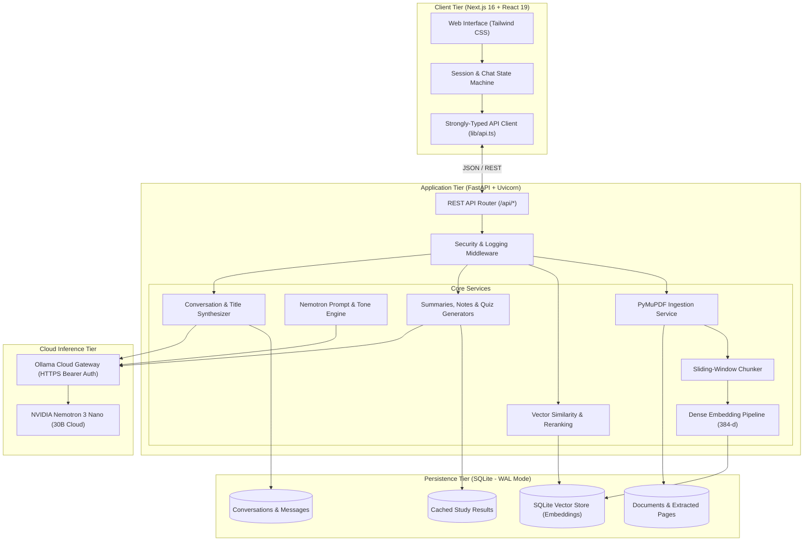

# StudyLens AI — Your PDF-Powered Academic AI Tutor

<p align="center">
  
  
  
  
  
  
  
  
  
</p>

---

## 📌 Executive Summary

**StudyLens AI** is an intelligent, retrieval-augmented academic tutoring system engineered for students, researchers, and educators. It transforms complex academic documents—textbooks, lecture slides, research papers, and technical manuals—into interactive, verifiable knowledge bases.

Built with a decoupled, enterprise-grade architecture:
- **Frontend**: Next.js 16 (App Router), React 19, TypeScript, and Tailwind CSS. Features a sleek, minimalist monochrome interface, smooth micro-animations, real-time citation verification drawers, and dedicated study suites.
- **Backend**: High-performance Python **FastAPI** backend with **PyMuPDF** page-level text extraction, dense vector embeddings, ACID **SQLite** persistence, and **Nemotron 3 Nano 30B Cloud via Ollama Cloud**.

---

## ✨ Key Features & Capabilities

### 1. 🎯 Grounded RAG with Zero Hallucination Guarantee
- **Verifiable Page-Level Provenance**: Every factual claim is backed by precise, clickable citations indicating document title and exact 1-indexed page numbers.
- **Backend-Enforced Attribution**: Citations are derived directly from SQLite vector retrieval metadata in Python—never hallucinated by the LLM.
- **Strict Fallback Policy**: If a question falls outside the uploaded document's context, the tutor transparently informs the student rather than fabricating answers.

### 2. 🎭 Adaptive Student & Gen Z Tone Matching
- **Intelligent Mirroring**: Dynamically adapts communication style to the student's vibe. If a student asks casually or with modern conversational slang, StudyLens responds naturally without sounding robotic or stiff.
- **Zero Academic Compromise**: Tone matching never compromises factual accuracy, formulas, or academic rigor.
- **No AI Filler / Slop**: Zero robotic preambles (*"Certainly!", "Great question!"*), zero cheesy emojis, and zero unnecessary fluff.

### 3. 🧠 Smart AI Conversation Title Distillation
- **Automatic Thread Titling**: Upon the first student exchange, the background pipeline uses Nemotron to synthesize a succinct, 3–5 word conceptual title (e.g., *"Quantum Tunneling Mechanics"*, *"TCP Handshake & Congestion"*).
- **Manual Auto-Summarize**: Sidebar control allowing users to re-distill long conversations at any time with one click.
- **Full Thread Lifecycle**: Rename, duplicate, switch, and delete sessions with foreign-key cascade integrity.

### 4. 📚 Dedicated Academic Study Suite
- **Hierarchical Document Summaries** (`POST /api/documents/{id}/summary`):
  - Executive overview, core themes, key takeaways, foundational definitions, and high-yield exam takeaways.
  - Automatically cached in SQLite for instant subsequent loads.
- **Structured Revision Notes** (`POST /api/documents/{id}/notes`):
  - High-yield, topic-by-topic markdown study notes.
  - Includes instant clipboard copying and 1-click `.md` export.
- **Interactive AI Quiz Workstation** (`POST /api/documents/{id}/quiz`):
  - Generates multiple-choice questions grounded directly in the document.
  - Instant submission feedback, detailed pedagogical answer explanations, and weak-topic identification.

### 5. 🎓 4 Pedagogical Tutor Modes
Switch modes on the fly to tailor explanation depth:
| Mode | Description | Ideal For |
| :--- | :--- | :--- |
| **Simple** | Plain language, accessible definitions, fundamental intuitions | Quick review & introduction |
| **Detailed** | Exhaustive technical breakdowns, mathematical proofs, mechanistic depth | Deep study & thesis research |
| **Exam** | High-scoring exam answers, bulleted definitions, criteria lists | Last-minute prep & tests |
| **ELI5** | Everyday real-world analogies without sacrificing technical correctness | Complex abstract concepts |

### 6. 🎨 Aesthetic, Fluid & Responsive UI
- **Monochrome Dark/Light Harmony**: Minimalist typography and sleek contrast designed for long reading sessions.
- **Micro-Animations**: Slide-in messages, subtle avatar float, smooth wave loading states, tactile button transitions, and modal zooms.
- **Uncluttered Navigation**: Streamlined top tabs (`Chat`, `Summary`, `Notes`, `Quiz`) and a persistent, collapsible document drawer.

---

## 🏛 System Architecture



---

## 📁 Repository Structure

```text
StudyLens AI/
├── backend/                             # Python FastAPI Backend
│   ├── app/
│   │   ├── api/routes/                  # REST Endpoints
│   │   │   ├── chat.py                  # Grounded Q&A and conversation routing
│   │   │   ├── conversations.py         # Thread lifecycle & AI title summarization
│   │   │   ├── documents.py             # PDF upload, listing, retrieval, deletion
│   │   │   ├── health.py                # System health & Ollama Cloud diagnostics
│   │   │   └── study_tools.py           # Summaries, Revision Notes, and Quizzes
│   │   ├── core/                        # Configuration & Core Logic
│   │   │   ├── config.py                # Pydantic Settings & environment validation
│   │   │   ├── errors.py                # Unified error taxonomy & HTTP handlers
│   │   │   ├── logging.py               # Structured logging & request timing
│   │   │   └── prompts.py               # Pedagogical system prompts & tone adapters
│   │   ├── db/                          # Database Infrastructure
│   │   │   ├── connection.py            # SQLite WAL connection pool & cascades
│   │   │   └── schema.sql               # Relational DDL tables & indexes
│   │   ├── models/                      # Domain entities (Document, Page, Chunk)
│   │   ├── repositories/                # Data access layer (Documents, Chats, Study)
│   │   ├── schemas/                     # Pydantic V2 Request & Response models
│   │   └── services/                    # Business Logic Layer
│   │       ├── chunking_service.py      # Semantic windowing & overlap chunker
│   │       ├── conversation_service.py  # Session persistence & AI title distillation
│   │       ├── embedding_service.py     # 384-dimensional vector embedding engine
│   │       ├── llm_service.py           # Ollama Cloud Nemotron 3 Nano client
│   │       ├── pdf_service.py           # PyMuPDF extraction & layout normalization
│   │       ├── retrieval_service.py     # Cosine similarity vector search
│   │       ├── study_tools_service.py   # Automated notes, summary & quiz generator
│   │       └── vector_store.py          # Isolated SQLite vector storage
│   ├── tests/                           # Comprehensive test suite (46+ unit/integration tests)
│   ├── main.py                          # FastAPI ASGI application factory
│   └── requirements.txt                 # Backend Python package requirements
├── frontend/                            # Next.js 16 + React 19 Frontend
│   ├── src/
│   │   ├── app/                         # App Router layout, providers & workstation
│   │   │   ├── globals.css              # Custom styling, animations & theme tokens
│   │   │   └── page.tsx                 # Central workstation & view manager
│   │   ├── components/
│   │   │   ├── chat/                    # Message bubbles, input bar, citation drawers
│   │   │   ├── document/                # Drag-and-drop PDF upload modal
│   │   │   ├── layout/                  # Collapsible sidebar, thread switcher & actions
│   │   │   └── study/                   # Study tool views (Summary, Notes, Quiz)
│   │   └── lib/
│   │       ├── api.ts                   # Fully typed API client
│   │       └── types.ts                 # TypeScript interfaces matching backend models
│   ├── package.json
│   └── tsconfig.json
├── docs/                                # Technical Documentation
│   ├── ARCHITECTURE.md                  # Detailed architectural design specification
│   └── DEMO_CHECKLIST.md                # 14-step end-to-end verification checklist
├── .env.example                         # Environment configuration template
└── README.md                            # Project documentation
```

---

## 🛠 Technology Stack

| Domain | Technology | Description |
| :--- | :--- | :--- |
| **Frontend Framework** | [Next.js 16](https://nextjs.org/) | Modern React 19 App Router with server-side stability |
| **UI Components & Style** | [Tailwind CSS v4](https://tailwindcss.com/) | Bespoke monochrome styling with micro-animations |
| **Icons** | [Lucide React](https://lucide.dev/) | Clean, consistent icons across controls and navigation |
| **Backend Framework** | [FastAPI](https://fastapi.tiangolo.com/) | High-speed asynchronous Python REST API framework |
| **Inference & LLM** | [Nemotron 3 Nano 30B](https://ollama.com/) | Hosted via Ollama Cloud API for low-latency reasoning |
| **Document Processing** | [PyMuPDF (fitz)](https://pymupdf.readthedocs.io/) | High-fidelity text, layout, and page-level extraction |
| **Vector & RAG** | NumPy + SQLite | Local isolated dense embeddings with cosine similarity |
| **Database** | SQLite3 (WAL Mode) | Zero-maintenance, ACID relational database with foreign keys |
| **Validation** | [Pydantic V2](https://docs.pydantic.dev/) | Strict data parsing, validation, and serialization |

---

## 🚀 Getting Started

### 1. Prerequisites
- **Python**: Version 3.10 or higher
- **Node.js**: Version 18 or higher (Node 20+ recommended)
- **Ollama Cloud Account**: Get an API key from [Ollama](https://ollama.com/)

---

### 2. Backend Setup

```bash
# 1. Clone the repository
git clone https://github.com/vishwass675-hub/StudyLens-AI.git
cd StudyLens-AI

# 2. Navigate to backend
cd backend

# 3. Create and activate a virtual environment
python -m venv .venv

# On Windows:
.venv\Scripts\activate
# On macOS / Linux:
source .venv/bin/activate

# 4. Install dependencies
pip install -r requirements.txt

# 5. Configure environment variables
cp .env.example .env
```

Edit `backend/.env` with your settings:
```env
OLLAMA_API_KEY=your_ollama_cloud_api_key_here
OLLAMA_BASE_URL=https://ollama.com
OLLAMA_MODEL=nemotron-3-nano:30b-cloud
DATABASE_PATH=backend/data/studylens.db
UPLOAD_DIR=backend/data/uploads
LOG_LEVEL=INFO
```

Launch the FastAPI backend server:
```bash
python -m uvicorn backend.main:app --host 127.0.0.1 --port 8000 --reload
```
- Swagger API Docs: `http://127.0.0.1:8000/docs`
- ReDoc Docs: `http://127.0.0.1:8000/redoc`

---

### 3. Frontend Setup

In a separate terminal window:
```bash
# 1. Navigate to frontend directory
cd frontend

# 2. Install dependencies
npm install

# 3. (Optional) Configure environment
# Defaults to http://127.0.0.1:8000 if NEXT_PUBLIC_API_URL is omitted
echo "NEXT_PUBLIC_API_URL=http://127.0.0.1:8000" > .env.local

# 4. Start Next.js development server
npm run dev
```

Open your browser at:
👉 **`http://localhost:3000`**

---

## 📡 API Reference Overview

| Method | Endpoint | Description |
| :--- | :--- | :--- |
| `GET` | `/api/health` | Health check verifying SQLite and Ollama Cloud connectivity |
| `POST` | `/api/documents/upload` | Upload and process an academic PDF into vector storage |
| `GET` | `/api/documents` | List all ingested documents with metadata and page counts |
| `GET` | `/api/documents/{id}` | Retrieve document details and processing status |
| `DELETE` | `/api/documents/{id}` | Permanently delete a document, its chunks, and associated data |
| `POST` | `/api/chat` | Send a query to the tutor with mode selection & citations |
| `GET` | `/api/conversations` | List persistent conversation threads |
| `GET` | `/api/conversations/{id}` | Get messages and history for a conversation |
| `PATCH` | `/api/conversations/{id}` | Rename a conversation title |
| `POST` | `/api/conversations/{id}/summarize-title` | Synthesize an AI title based on chat history |
| `DELETE` | `/api/conversations/{id}` | Delete a conversation thread and its messages |
| `POST` | `/api/documents/{id}/summary` | Generate or retrieve cached document summary |
| `POST` | `/api/documents/{id}/notes` | Generate or retrieve cached revision notes |
| `POST` | `/api/documents/{id}/quiz` | Generate an interactive multiple-choice quiz |
| `POST` | `/api/documents/{id}/quiz/evaluate` | Evaluate quiz responses and receive study feedback |

---

## 🧪 Testing & Verification

Run the comprehensive automated test suite:

```bash
# Run backend test suite
pytest backend/tests -v

# Run full end-to-end integration scenario probe
python -m backend.tests.probe_full_scenario

# Verify frontend TypeScript types and build
cd frontend
npx tsc --noEmit
npm run build
```

---

## 🔒 Security & Privacy

1. **Backend-Isolated Credentials**: API keys (`OLLAMA_API_KEY`) remain strictly in server-side memory and are never sent to the browser.
2. **Document-Level Query Isolation**: Vector searches enforce strict document ID scoping, preventing information leakage across documents.
3. **Safe Storage**: Uploaded files and vector databases are stored locally with sanitization against directory traversal attacks.
4. **No Sensitive Request Logging**: Middleware logs route, status, and execution duration without exposing document payloads or auth tokens.

