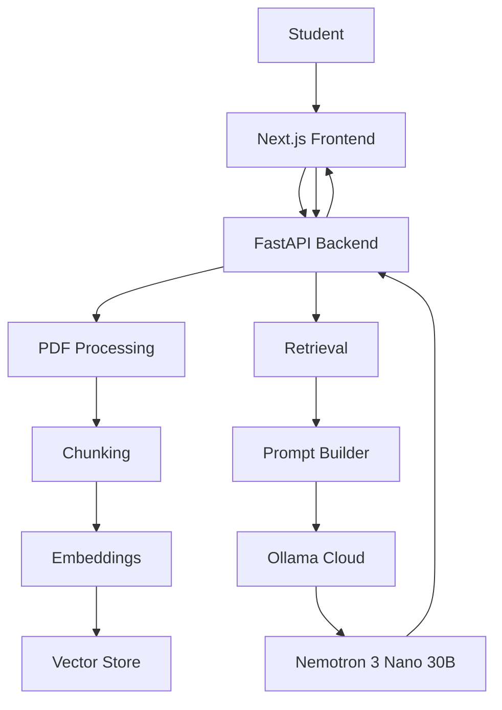

# StudyLens AI — Technical Architecture

This document outlines the end-to-end system architecture, data processing pipelines, persistence model, and security boundaries of **StudyLens AI — Your PDF-Powered Academic AI Tutor**.

---

## 1. System Overview

StudyLens AI is an academic AI tutor application designed for students to ingest complex textbooks, lecture notes, and research papers, retrieve context with high semantic precision, and ask questions to a grounded tutor LLM (**Nemotron 3 Nano 30B Cloud** via Ollama Cloud) with accurate page-level citations.



---

## 2. Component Architecture

### Frontend
- **Framework**: Next.js (App Router) + React + TypeScript
- **Styling**: Tailwind CSS with custom academic design system tokens
- **Icons**: Lucide React
- **Architecture**:
  - `src/app/page.tsx`: Central state machine and workstation layout
  - `src/components/layout/`: Responsive collapsible sidebar (Document Library + Recent Chats)
  - `src/components/chat/`: Message bubbles, prompt composer, quick actions, starter prompts
  - `src/components/study/`: Interactive views for structured summaries, revision study notes, and self-assessment quizzes
  - `src/lib/api.ts`: Centralized, type-safe API client layer (no raw fetch calls in components)
  - `src/lib/types.ts`: Strict TypeScript contracts matching backend Pydantic schemas

### Backend
- **Framework**: FastAPI + Uvicorn (ASGI)
- **Architecture**:
  - `backend/app/api/routes/`: REST endpoints (`health`, `documents`, `chat`, `study_tools`, `conversations`)
  - `backend/app/schemas/`: Pydantic V2 request and response contracts
  - `backend/app/services/`: Core business logic (`pdf_service`, `chunking_service`, `embedding_service`, `vector_store`, `retrieval_service`, `llm_service`, `study_tools_service`, `conversation_service`)
  - `backend/app/repositories/`: SQLite data access layer (`document_repo`, `conversation_repo`, `study_results_repo`)
  - `backend/app/db/`: ACID SQLite connection manager with WAL mode and foreign key cascades
  - `backend/app/core/`: Centralized settings (`config.py`), error taxonomy (`errors.py`), structured logging middleware (`logging.py`), and prompt templates (`prompts.py`)

---

## 3. Core Pipelines

### A. Document Pipeline
`PDF Upload` $\rightarrow$ `Validation` $\rightarrow$ `Page Extraction` $\rightarrow$ `Text Cleaning` $\rightarrow$ `Chunking`

1. **Validation**: Verifies `%PDF` magic bytes and file extension. Enforces `MAX_FILE_SIZE_MB` (50MB) and `MAX_PAGES_LIMIT` (200 pages).
2. **Page Extraction**: PyMuPDF extracts text page-by-page, preserving 1-indexed page provenance. Clean resources are guaranteed via `doc.close()` in finally blocks.
3. **Text Cleaning**: Normalizes extraction noise, collapses consecutive linebreaks, and repairs hyphenated words broken across lines.
4. **Chunking**: Sliding window chunker partitions text with `DEFAULT_CHUNK_SIZE` (1000 chars) and `DEFAULT_CHUNK_OVERLAP` (200 chars), ensuring sentence boundaries are respected.

### B. Retrieval Pipeline
`Chunks` $\rightarrow$ `Dense Embeddings` $\rightarrow$ `Persistent Vector Store` $\rightarrow$ `Cosine Similarity Search`

1. **Dense Embeddings**: Generates normalized 384-dimensional dense vectors for chunks and queries via `EmbeddingService`.
2. **Local Vector Store**: Embeddings are stored as binary float32 blobs in SQLite (`data/vector_store/vectors.db`) accompanied by chunk text and page metadata.
3. **Document-Isolated Retrieval**: Chunks are strictly filtered by `document_id`. Only chunks belonging to the active document are evaluated for cosine similarity, completely eliminating cross-document pollution.
4. **Relevance Thresholding**: Filters candidates by `SIMILARITY_THRESHOLD` (0.30). If no chunk meets the threshold, returns an explicit fallback without hallucinating.

### C. Generation Pipeline
`Retrieved Context` $\rightarrow$ `Bounded History` $\rightarrow$ `Prompt Builder` $\rightarrow$ `Ollama Cloud` $\rightarrow$ `Nemotron 3 Nano`

1. **Prompt Builder**: Assembles structured prompt sections (Tutor Mode instructions, bounded recent turns, numbered document context blocks with page provenance, and user question).
2. **Tutor Pedagogical Modes**: Supports `simple`, `detailed`, `exam`, and `eli5` modes.
3. **Ollama Cloud Ingestion**: Posts to `https://ollama.com/api/chat` authenticated via backend-only Bearer token.
4. **Citation Extraction**: Sources are extracted strictly from retrieval metadata (`document`, `page`), never parsed out of LLM text.

---

## 4. Persistence Model

Metadata is persisted in an SQLite relational database (`backend/data/studylens.db`) with foreign key constraints and cascading deletes:

- **`documents`**: ID, filename, page count, word/char counts, status, timestamps (`created_at`, `updated_at`, `last_accessed_at`).
- **`pages`**: Extracted text per page keyed by `(document_id, page_number)`.
- **`conversations`**: Multi-turn sessions tied to `document_id` with automatic question-derived titles.
- **`messages`**: Multi-turn student questions and tutor answers with JSON serialized source citations.
- **`study_results`**: Persistent cache for expensive AI outputs (summaries, notes, quiz configurations) keyed by `(document_id, result_type, config_hash)`.

### Cascading Deletion
Deleting a document (`DELETE /api/documents/{id}`) guarantees zero orphaned data:
1. Deletes dense vectors from `data/vector_store/vectors.db`.
2. Deletes cached study results in SQLite.
3. Deletes database records from `documents` (cascading pages, conversations, and messages).
4. Unlinks the uploaded physical PDF file from `data/uploads/`.
5. Invalidates in-memory runtime cache.

---

## 5. Security Boundary & Privacy

```text
[ Browser / Client ]
        │  No credentials exposed
        ▼
[ FastAPI Backend ]  (Strict boundary: Holds OLLAMA_API_KEY)
        │  Bearer token over HTTPS
        ▼
[ Ollama Cloud API ] (nemotron-3-nano:30b-cloud)
```

- **Credential Isolation**: The `OLLAMA_API_KEY` is loaded only in `backend/app/core/config.py` and is never exposed in client bundles, OpenAPI schemas, or API responses.
- **Zero Sensitive Logging**: The ASGI logging middleware sanitizes requests and never logs Authorization headers, credentials, full PDF contents, or message bodies.
- **Input Validation**: Client document IDs and conversation IDs are validated for existence and relation before retrieval or mutation occurs.
